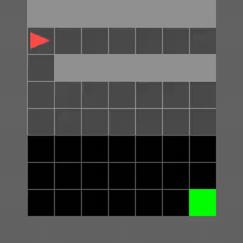
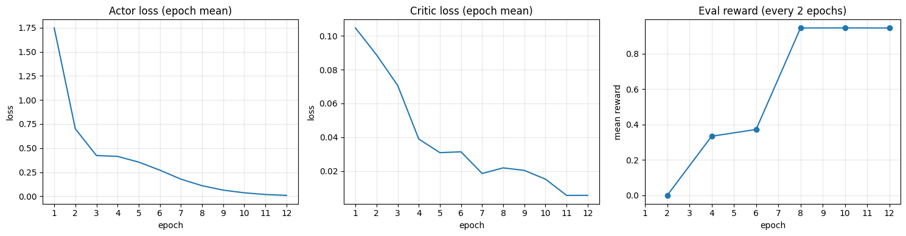
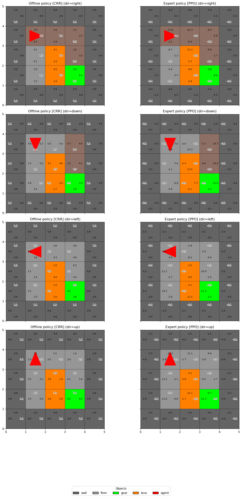

# tiny-rl

Hands-on examples for training offline RL algorithms in synthetic environments.

### Critic-Regularized Regression (MiniGrid-SimpleCrossingS9N1-v0)

Example trajectory for trained model:

Loss/reward plots:

### Critic-Regularized Regression (MiniGrid-LavaGapS5-v0)

Example policy for trained model:
